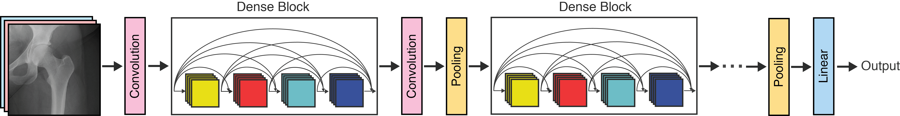
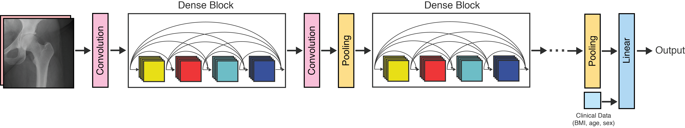
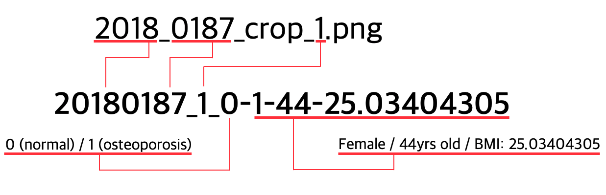
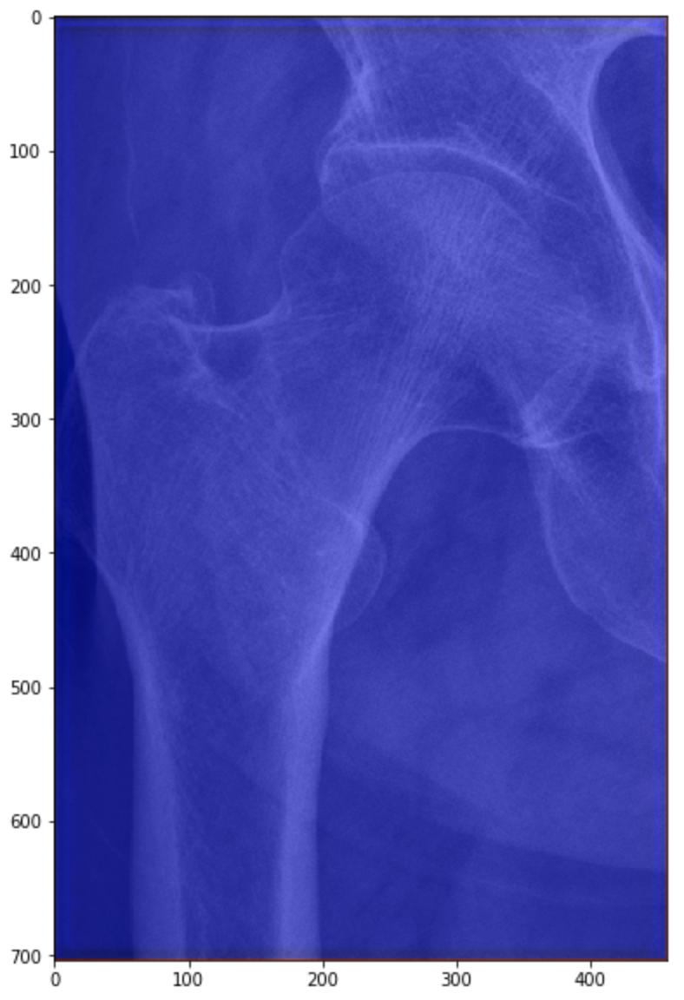

# Osteoporosis Classification

This work uses dense-net neural network to predict osteoprosis from hip x-ray images of patients.

The command to run the neural net is

```bash
python3 main.py --model dense_net --fold _Dense_LF --augment cat_elastic --late_fuse True
```

where `--model` is the command for choosing the neural network structure (is `dense_net` as default), `--augment` is augmentation option (`cat_elastic` is augmentation for concatenated image -- i.e. concatenation of original image + enhanced image).



If you want the model to lately fuse clinical information to the network (which is added up to the image itself as default), option `--late_fuse` should be `True`.



## Data preprocessing

The original file is `pateint_list.csv` given with x-ray images. To add all useful informations (i.e. true label, clinical informations such as BMI, age, sex) we read the csv file and added them to the file name as below:



All images were cropped / resized into fixed size(704 x 407).


## Training

When training starts, either `ClassifyTrainer.py` or `LateFuseClassifyTrainer.py` are executed depending on the `--late_fuse` option. Images are loaded using the data loader (is in `loader.py`), and converted into a format which is compatible for training the neural network. About 30 percent of the images are augmented using many different transforms, depending on the augmentation option `--augment`.

The default loss function is Binary Cross Entropy Loss. The trainer trains model using the training set, and validates its performance using the validation set for each epoch. Many different metrics (F0.5, F1, F2 score, accuracy, etc.) are calcualted to evaluate the model's performance for the validation set. The model with the best performance among all epochs is selected as the best model, and then tested using the test set data. The final performance of the deep learning model is thus the metric scores calculated for the test set data. *(Don't get confused with the validation set!)*


## Grad-CAM (Visualization)

Grad-CAM is a method that can visualize image features which were important (or meaningful) in classifying the image to that specific class. To visualize Grad-CAM heatmap for manullay selected test image, run `visualize_gradcam.py`. (check `visualize_gradycam.py` for details) After executing the code, you will notice that the x-ray image overlayed with the Grad-CAM heatmap is generated. You would get something similar to this if you open the generated image:

